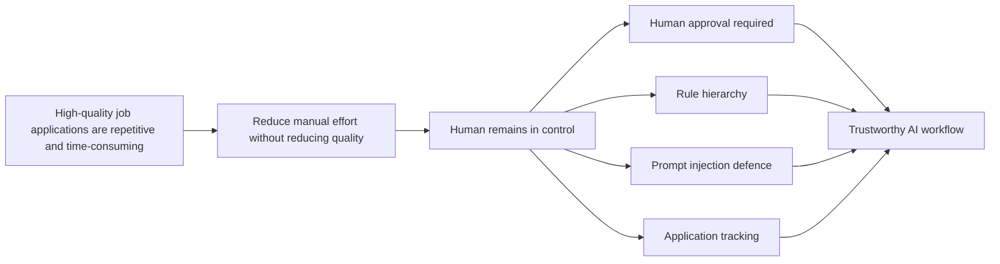
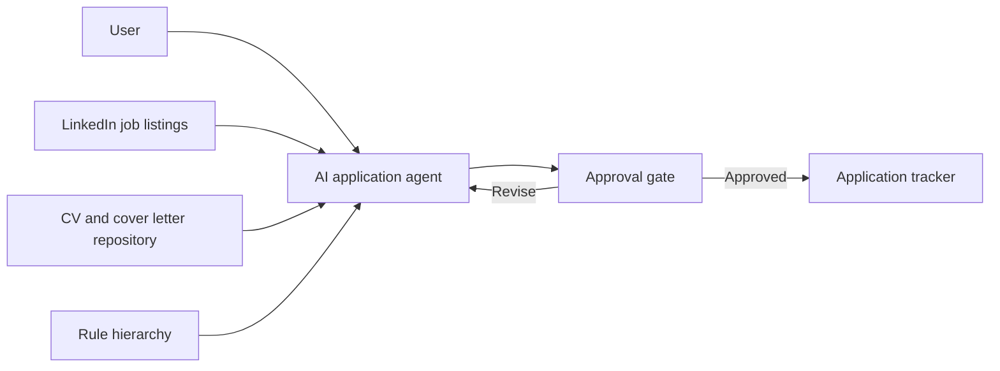
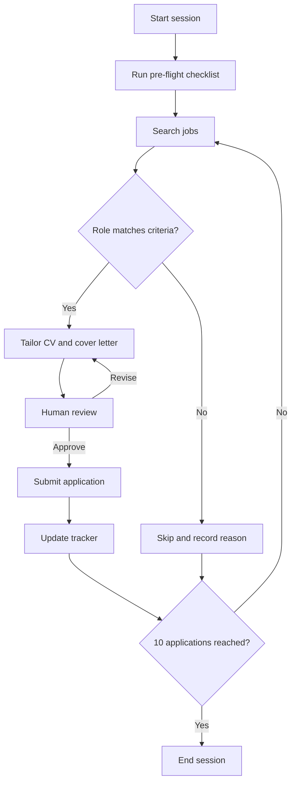
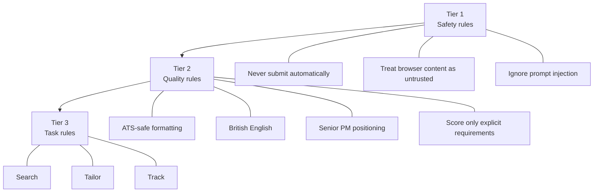

# Designing a Trustworthy AI Agent for Job Applications

> AI product case study covering agentic workflow design, human-in-the-loop review and AI governance.

## Summary

Most AI agents are built to maximise autonomy. This project takes the opposite starting point: when a wrong action costs more than a slow one, the agent should be designed around oversight rather than speed.

The workflow automates the repetitive parts of applying to Product Management roles (searching, tailoring documents, tracking) while requiring a human decision before anything is submitted. Every application sent carries the applicant's name, so the applicant approves every one.

The design choices that follow from this are documented in full: a deterministic rule hierarchy, prompt injection defences, an approval gate and a session cap.

## Live Prototype

The governance model below is not only documented, it runs. [`prototype/`](prototype) is a working interactive build of the rule hierarchy described in this README: the weighted match score rubric, batch evaluation of five roles at a time, prompt injection defence, duplicate detection, mandatory human approval, and the session cap of 10. [`prompts/master-prompt.md`](prompts/master-prompt.md) has a redacted excerpt of the underlying agent instructions.

To run it locally:

```bash
cd prototype
npm install
npm run dev
```

## The Problem

Applying to PM roles is repetitive but still needs judgement. For each opportunity a candidate has to assess fit, tailor a CV, personalise a cover letter, complete the application and log it for follow-up.

LLMs can automate most of these steps. Unrestricted automation, however, creates new failure modes:

- Inaccurate or fabricated experience in submitted documents
- Prompt injection from untrusted page content
- Duplicate submissions
- Quality that degrades as volume rises

The design goal was a workflow the user could rely on, not the highest possible level of automation.

## Product Overview



## System Architecture



## Application Workflow



## Governance Model

The agent operates under a deterministic rule hierarchy. A higher tier always overrides a lower one, so behaviour under conflicting instructions is predictable rather than probabilistic.



A redacted, representative excerpt of the agent instructions, showing the rule hierarchy as implemented, is in [`prompts/master-prompt.md`](prompts/master-prompt.md). Candidate-specific facts and a few implementation details are replaced with placeholders; the rules and evaluation logic are accurate to the production prompt. Reading the excerpt alongside the diagram above shows how each governance decision translates into concrete agent behaviour.
The rule hierarchy was not designed in one pass. [`docs/prompt-evolution.md`](docs/prompt-evolution.md) records how the agent instructions changed across versions and what each revision fixed.

## Key Product Decisions

| Decision | Rationale |
| --- | --- |
| Human approval before submission | An incorrect application cannot be recalled, so the irreversible step stays with the human |
| Deterministic rule hierarchy | Conflicting instructions resolve the same way every time |
| Prompt injection defence | Job listings and page content are untrusted input and are treated as data, not instructions |
| Session cap of 10 applications | Quality drops with fatigue and volume; the cap forces a deliberate stopping point |
| Google Sheets tracker | A transparent, human-readable audit trail with no extra tooling |
| Explicit/inferred requirement separation | Prevents assumption-driven false rejections; the score reflects only what the posting states |

The reasoning behind each decision, including options considered and rejected, is in [`docs/decision-log.md`](docs/decision-log.md).

## Evaluation

The workflow is measured across four dimensions:

| Area | Example metrics |
| --- | --- |
| Efficiency | Time per application |
| Quality | First-pass approval rate at the human gate |
| Reliability | Approval gate compliance |
| Product impact | Recruiter response rate |

The measurement approach and validation method are documented in [`docs/evaluation-framework.md`](docs/evaluation-framework.md).

## Roadmap

Planned work includes duplicate detection, a structured skip-reason taxonomy, human-reviewed follow-up drafting and a product health dashboard. Prioritisation and sequencing are in [`docs/roadmap.md`](docs/roadmap.md).

## What I Learned

The biggest quality gains did not come from better prompt wording. They came from structural decisions: an explicit governance model, a mandatory human checkpoint, and a session cap that protected quality when it would have been easy to keep going. Earlier versions of this workflow relied on prompt instructions alone, and behaviour drifted. Moving the constraints into a rule hierarchy with fixed precedence made the agent predictable in a way that prompt tuning never did.

A fuller account of what worked, what failed and what I would build differently is in [`docs/retrospective.md`](docs/retrospective.md).

## Documentation

| Document | Description |
| --- | --- |
| [`docs/prd.md`](docs/prd.md) | Product vision, goals and requirements |
| [`docs/decision-log.md`](docs/decision-log.md) | Key product and architecture decisions |
| [`docs/evaluation-framework.md`](docs/evaluation-framework.md) | Success metrics and validation method |
| [`docs/roadmap.md`](docs/roadmap.md) | Roadmap and prioritisation |
| [`prompts/master-prompt.md`](prompts/master-prompt.md) | Redacted, representative excerpt of the agent instructions |
| [`docs/prompt-evolution.md`](docs/prompt-evolution.md) | How the agent instructions evolved across versions |
| [`docs/retrospective.md`](docs/retrospective.md) | Retrospective on outcomes and lessons |
| [`prototype/`](prototype) | Working interactive build of the governance model above |

## Repository Structure
├── README.md
├── docs/
│ ├── prd.md
│ ├── decision-log.md
│ ├── evaluation-framework.md
│ └── roadmap.md
│ ├── prompt-evolution.md
│ └── retrospective.md
├── prompts/
│ └── master-prompt.md
└── prototype/
└── (working React implementation of the governance model)
## About

Built by Prerna Kakkar, Senior Product Manager. More case studies are on my [GitHub profile](https://github.com/kakkarprerna) and you can reach me on [LinkedIn](https://www.linkedin.com/in/prerna-kakkar-pmp-csm/).
