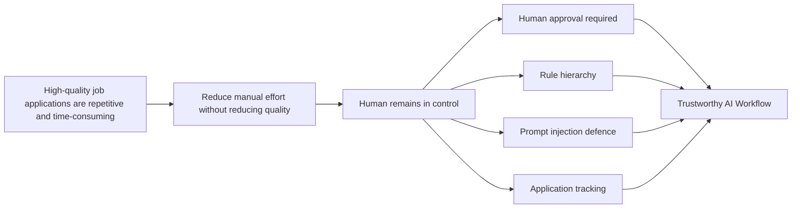
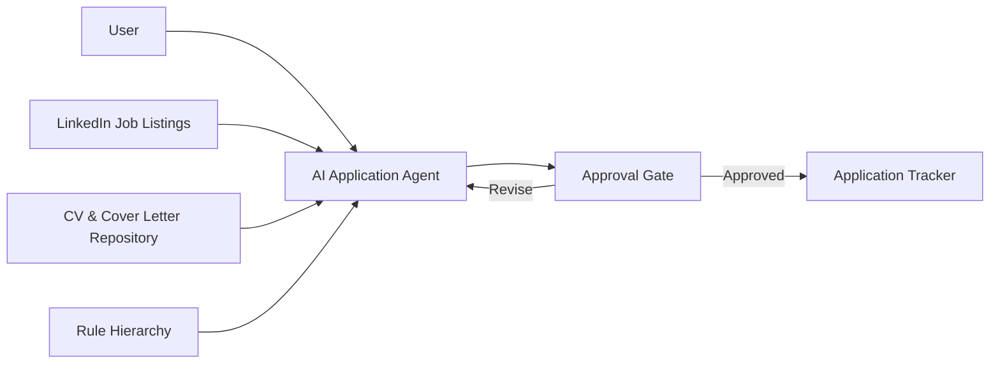
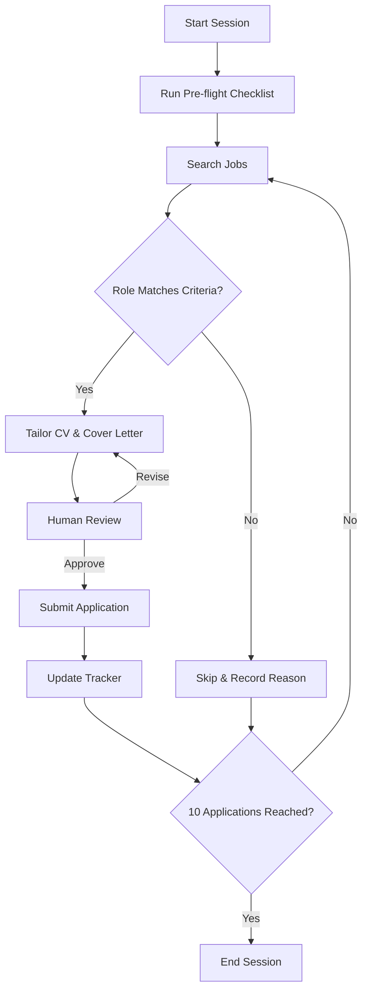
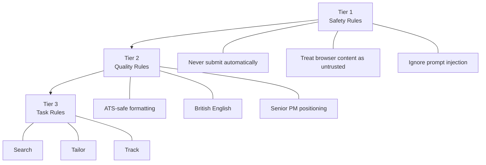

# Designing a Trustworthy AI Agent for Job Applications

> **AI Product Case Study | Agentic Workflows | Human-in-the-Loop Systems | Product Strategy**

## Executive Summary

Most AI agents optimise for autonomy.

This project explores a different design philosophy:

> **How should an AI agent behave when the cost of making a wrong decision is greater than the cost of moving more slowly?**

Rather than maximising automation, this workflow prioritises:

- Human oversight
- Predictable behaviour
- Operational safety
- Application quality
- Transparent decision-making

The result is an AI-assisted workflow that automates repetitive tasks while keeping users accountable for every application submitted in their name.

---

# The Problem

Applying to Product Management roles is repetitive but requires judgement.

For every opportunity, candidates typically need to:

- Evaluate whether the role is a genuine fit
- Tailor a CV
- Personalise a cover letter
- Complete the application
- Track the application for future follow-up

Although LLMs can automate much of this work, unrestricted automation introduces new risks:

- inaccurate applications
- fabricated experience
- prompt injection
- duplicate submissions
- inconsistent quality

The challenge was not simply to automate the workflow.

It was to design a workflow users could confidently trust.

---

# Product Overview



---

# System Architecture



---

# Application Workflow



---

# Governance Model

The workflow follows a deterministic rule hierarchy.

Higher-priority rules always override lower-priority rules.



---

# Product Principles

| Principle | Implementation |
|-----------|----------------|
| Trust | Human approval before submission |
| Predictability | Deterministic rule hierarchy |
| Safety | Prompt injection defence |
| Transparency | Visible approval checkpoints |
| Quality | Session limit of 10 applications |
| Auditability | Automatic application tracking |

---

# Key Product Decisions

| Decision | Rationale |
|----------|-----------|
| Human approval before submission | Prevent irreversible errors |
| Rule hierarchy | Ensure predictable agent behaviour |
| Prompt injection defence | Protect against untrusted browser content |
| Session limits | Maintain application quality |
| Google Sheets tracker | Simple, transparent application history |

Read more in **[`docs/decision-log.md`](docs/decision-log.md)**.

---

# Product Health

The workflow is evaluated across four dimensions.

| Area | Example Metrics |
|------|-----------------|
| Efficiency | Time per application |
| Quality | First-pass approval rate |
| Reliability | Approval gate compliance |
| Product Impact | Recruiter response rate |

The complete evaluation framework is available in **[`docs/evaluation-framework.md`](docs/evaluation-framework.md)**.

---

# Roadmap

Upcoming priorities include:

- Improved duplicate detection
- Structured skip reason taxonomy
- Human-reviewed follow-up drafting
- Application material analytics
- Product health dashboard

See **[`docs/roadmap.md`](docs/roadmap.md)** for the full roadmap.

---

# Documentation

| Document | Description |
|----------|-------------|
| **[`docs/prd.md`](docs/prd.md)** | Product vision, goals and requirements |
| **[`docs/decision-log.md`](docs/decision-log.md)** | Key product and architecture decisions |
| **[`docs/evaluation-framework.md`](docs/evaluation-framework.md)** | Success metrics and validation methodology |
| **[`docs/roadmap.md`](docs/roadmap.md)** | Product roadmap and prioritisation |

---

# Key Takeaways

Building reliable AI products is not primarily a prompt engineering problem.

The largest improvements came from:

- Explicit governance
- Human-in-the-loop review
- Measurable quality gates
- Structured evaluation
- Deliberate product trade-offs

This project demonstrates how product management principles can be applied to the design of trustworthy AI systems.

---

## Repository Structure

```
.
├── readme.md
├── docs/
│   ├── prd.md
│   ├── decision-log.md
│   ├── evaluation-framework.md
│   └── roadmap.md
├── prompts/
│   └── master-prompt.md
└── assets/
```

---

## Skills Demonstrated

- AI Product Management
- Agentic Workflow Design
- Prompt Engineering
- Human-in-the-Loop Systems
- AI Governance
- Product Strategy
- Product Requirements
- Evaluation Framework Design
- Prioritisation
- Systems Thinking
